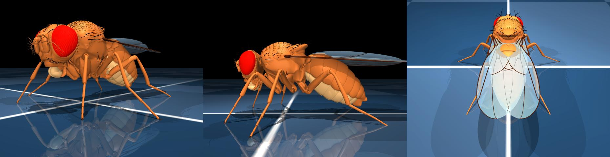
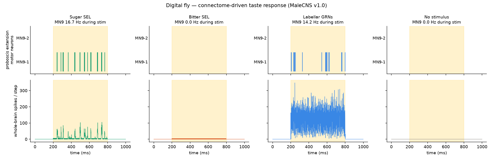
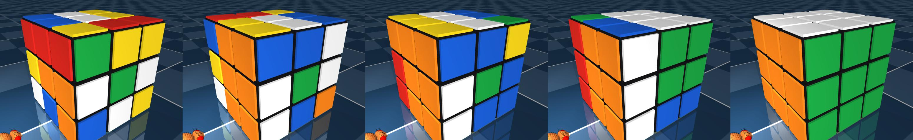
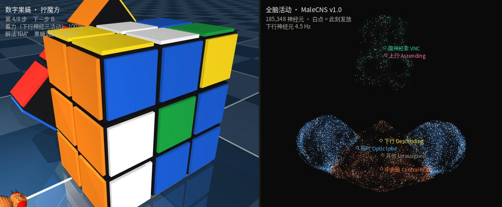
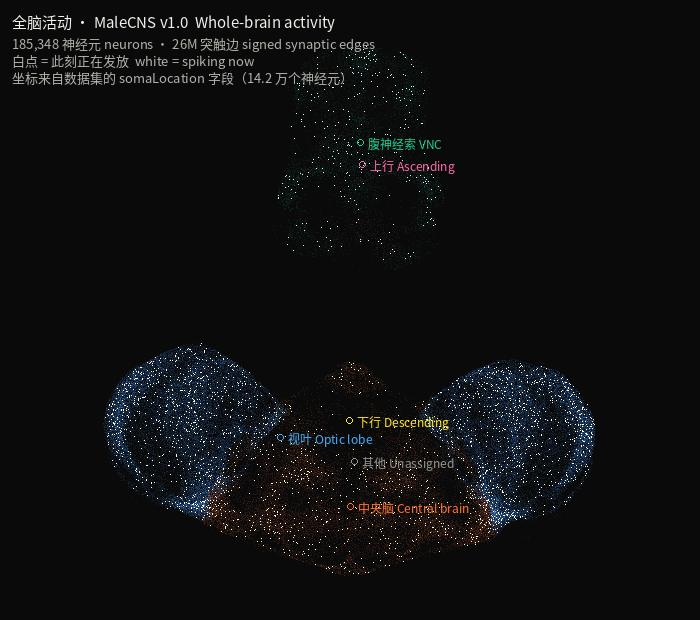

# Digital Fly · 数字果蝇

**English** · [中文](README.zh-CN.md)

A digital fruit fly: a **real whole-CNS connectome** driving a **real biomechanical
body** in physics simulation.

```
  World ──► sensory neurons ──► whole-brain spiking net (185k) ──► descending ──► muscles
    ▲                    MaleCNS v1.0 · 26M signed synaptic edges              │
    │                                                                          ▼
    └──────────── proprioceptive feedback ◄────────────────── MuJoCo physics body ┘
```



*The body at rest: wings folded over the abdomen, standing on six legs.
`ctrl = 0` is a genuinely stable posture — every gait is built on top of it.*

---

## What this is built from

### 1. Brain — MaleCNS v1.0 connectome

The electron-microscopy wiring diagram of a **complete male fruit fly central
nervous system**: central brain + optic lobes + ventral nerve cord (the insect
spinal cord). **176,422 neurons, ~125 million synapses**, roughly 44 person-years
of manual proofreading.

Produced by HHMI Janelia FlyEM, the University of Cambridge, the MRC Laboratory of
Molecular Biology and **Google Research**. v1.0 released 2026-06-08, paper in *Cell*
2026-09-03. CC-BY 4.0.

What makes it the right dataset for an embodied fly: **it is the first atlas to put
the brain and the body's nervous system in one volume with the neck connective
intact** — so the "brain commands body" pathway is traceable end to end.

### 2. Body — flybody

An anatomically detailed adult *Drosophila* model for MuJoCo: six legs, wings,
proboscis, antennae, with a fluid model for aerodynamics. Built by
**Google DeepMind × HHMI Janelia**, *Nature* 643 (2025).

This project uses its `FruitFly` assembly class to configure the body per behaviour
(wings retracted when walking, legs retracted when flying). It does **not** use the
accompanying RL training stack (TensorFlow/acme).

### 3. Gait — NeuroMechFly v2 / flygym

Real fly leg kinematics, retargeted onto the flybody model by NeLy-EPFL. Only the
data file is used; the package itself is not a runtime dependency (it pins
`mujoco<3.10`, which conflicts with `dm_control`).

---

## What is data and what is assumption

This distinction matters more than anything else in the project, so it is stated up
front and repeated throughout the code.

**Directly from data:**

- Who connects to whom, and how many synapses — the connectome edge table.
- Whether each synapse is excitatory or inhibitory — determined by the presynaptic
  neuron's predicted neurotransmitter (ACh → excitatory; GABA / glutamate /
  histamine → inhibitory; 85,484 neurons have experimental ground truth).
- Which neurons are sensory, descending, motor; which thoracic segment and side —
  official annotation fields.
- Neuron dynamics — the leaky integrate-and-fire model validated by Shiu et al.,
  *Nature* (2024) on FlyWire (rest −52 mV, threshold −45 mV, τ_m 20 ms, refractory
  2.2 ms). **Per-synapse strength must be recalibrated for this dataset** — see below.

**Engineering assumptions (no connectome provides these):**

- The quantitative scale from population firing rate to walking speed / turn rate.
  The connectome says who wires to whom, not how many cm/s per Hz.
- The gait itself. How legs step is a kinematic model (from real fly recordings),
  not read out of the connectome. MaleCNS contains a complete VNC, so in principle
  a central pattern generator should emerge from it — but that needs intrinsic
  oscillatory properties of neurons (ion channel dynamics) that EM reconstruction
  does not contain. flybody's own walking tasks likewise track reference
  trajectories rather than generating gait from a network.

So the division of labour is: **the connectome decides *what to do* (speed, whether
to extend the proboscis); the pattern generator handles *how to do it* (joint
trajectories).** That split is the fly's own — see below.

---

## Quick start

```bash
bash setup.sh                 # conda env `digitalfly`, deps, flybody, step data
conda activate digitalfly

python cli.py download        # connectome, ~1.06 GB, resumable, 8 parallel streams
python cli.py build           # signed sparse synaptic matrix (~27 s, then instant)
python cli.py calibrate       # calibrate synaptic strength (see below, ~20 s)
python cli.py doctor          # self-check: scale, NT distribution, interfaces

python cli.py sim --exp sugar_pe     # sugar → proboscis extension
python cli.py sim --exp ablation     # ablation experiment
python cli.py sim --exp steering     # can the connectome read odour laterality?
python cli.py sim --exp cube_decode  # can it decode the next cube move?
python cli.py sim --exp vision       # can it tell digits apart?
python cli.py sim --exp conditioning # the fly learning with its own synapses
python cli.py train-vision           # train the handwriting read-out

python cli.py behave --what walk     # walking
python cli.py behave --what forage   # foraging
python cli.py behave --what flight   # tethered flight
python cli.py behave --what cube     # solving a Rubik's cube

python cli.py web --port 8080        # interactive web console
pytest tests/                        # 74 tests
```

---

## Synaptic strength must be recalibrated

Shiu et al. used 0.275 mV per synapse on FlyWire (130k neurons, 50M synapses).
Transplanting that constant to MaleCNS v1.0 breaks: this dataset includes the VNC —
185k neurons, 125M synapses, ~677 synapses of input per neuron, 1.8× FlyWire.
**At 0.275 mV, stimulating six neurons drives the whole network into a
self-sustaining ~48 Hz discharge that does not stop when the stimulus is removed** —
a seizure, not a fly brain.

The calibration criterion is **non-self-sustaining**: binary-search the largest
synaptic strength for which activity decays back to silence after the stimulus ends.
On this dataset the critical value is **0.0358 mV**; the operating point is 0.95× of
it, **0.0341 mV**.

The criterion involves no behavioural outcome, so it cannot smuggle in the desired
conclusion — whether taste drives proboscis extension is tested afterwards, as an
independent question.

---

## Key validation: sugar → proboscis extension

`python cli.py sim --exp sugar_pe`



No training, no tuning — connectome plus LIF dynamics only. The readout is **MN9**,
the proboscis extension motor neuron used by Shiu et al.

| Stimulus | n | MN9 rate | whole-brain |
|---|---|---|---|
| Sugar pathway (Sugar SEL) | 6 | **16.7 Hz** | 0.06 Hz |
| Bitter pathway (Bitter-SEL) — negative control | 4 | **0.0 Hz** | 0.00 Hz |
| Labellar GRNs (primary taste input) | 163 | **14.2 Hz** | 0.78 Hz |
| No stimulus — baseline | 0 | **0.0 Hz** | 0.00 Hz |

The direction matches the real animal: sugar drives extension, bitter does not
(bitter suppresses proboscis extension in real flies). Whole-brain activity stays
below single-digit Hz throughout — sparse, physiological firing, not a global
avalanche.

The sugar and bitter pathway identities come from the dataset's `synonyms` field,
which records neurons identified by Yao & Scott (2022) — not guessed from names.
Both groups are predicted **serotonergic**; treating monoamines as silent (the
textbook "modulators are not fast transmission" rule) removes them from the network
entirely and the experiment returns all zeros. `connectome.py` documents why they
are treated as excitatory and how to run the `--modulator-sign 0` control.

---

## Ablation

`python cli.py sim --exp ablation`

A loss-of-function experiment that takes months with genetic tools in a real fly is
one line here, and can be run exhaustively. Stimulate labellar GRNs, read MN9,
ablate pathways one at a time:

| Ablated | n | MN9 rate | vs intact |
|---|---|---|---|
| (intact network) | — | 17.5 Hz | 100% |
| Sugar pathway (Sugar SEL) | 6 | 70.0 Hz | **400%** |
| Bitter pathway (Bitter-SEL) | 4 | 46.2 Hz | 264% |
| All descending neurons | 1,314 | 20.0 Hz | 114% |

Removing the sugar pathway *increases* proboscis extension fourfold. This is not a
bug: of the 1,616 direct downstream partners of Sugar SEL, 549 are inhibitory, and
36 of those project directly onto MN9 with a total inhibitory weight of −405.
Ablating them lifts a feed-forward inhibition. Counterintuitive results like this
are exactly what connectome simulation is for — and a reminder that the
serotonin-as-excitatory assumption materially changes the conclusion.

---

## Behaviours

```bash
python cli.py behave --what walk | forage | flight | cube
```

All four share one structure:

```
world/body ─► sensory neurons ─► whole-brain LIF net ─► descending neurons ─► command
                                                                  │
                                        pattern generator ─► joint trajectories ─► physics
```

### Why descending neurons carry commands, not joint angles

This was got wrong at first and is worth recording. A fly's walking rhythm is not
computed joint-by-joint by the brain: leg ganglia in the ventral nerve cord contain
central pattern generators that produce tripod phase relationships on their own,
and the brain issues **commands** through descending neurons — "walk faster",
"turn left". Decapitate a fly and the VNC still produces rhythmic leg movement.
That is a classic result.

Mapping descending activity straight onto joint targets made the fly collapse on
the spot. Anchoring to the rest posture and modulating around it kept it upright,
but it only twitched in place. Only after wiring descending neurons as a command
layer did it actually walk.

### Gait uses real fly kinematics

A hand-tuned sinusoidal tripod gait reached ~0.5 body-lengths/s with a marginal
posture. What is used now is `single_steps_flybody.npz` from
**NeuroMechFly v2 / flygym** (NeLy-EPFL): real fly leg kinematics recorded on a ball
and retargeted onto the flybody model, giving one full step cycle of 7 joint angles
per leg position plus swing-phase fractions.

| | speed | heading drift over 3 s |
|---|---|---|
| Hand-tuned sinusoidal gait | 0.5 BL/s | large, posture marginal |
| **Real step kinematics** | **2.6 BL/s** | **2.3° (after trim)** |

Real flies walk at 1–3 body-lengths/s.

### Walking


```
[body] walk config: 65 actuators (wings folded), step frequency 12.0 Hz
forward along initial heading 1.05 = 1.22 BL/s   whole-brain 2.99 Hz   DN 4.6 Hz
```

Speed is read out from descending population activity and ramps up as the network
warms up — it looks like a fly accelerating from a standstill.

**Wings must be retracted.** In an earlier version the wings were flung away from
the body and looked detached; the cause was writing control values to wing joints
(yaw travel reaches ±3 rad). Real flies fold their wings when walking; the
corresponding setting is `use_wings=False`.

### Foraging

```
distance to sugar 2.51 → 0.30, reached at 2.7 s
MN9 peak 200 Hz (computed by the connectome)
```

**What the connectome does and does not do here:**

- **Does** — walking speed, read out from descending neurons.
- **Does** — the decision to extend the proboscis. On contact, taste input
  propagates through the whole-brain network to MN9, and MN9's firing drives the
  mouthparts. Same pathway validated by `sim --exp sugar_pe`.
- **Does not** — steering. An explicit bilateral-comparison chemotaxis rule is used
  instead, for the reason given below.

### Tethered flight


```
wingbeat 218 Hz   left wing stroke amplitude 1.22 rad
steering command (L−R amplitude difference) mean −0.048
```

**Why tethered rather than free flight.** Free-flight attitude stabilisation needs a
learned controller: flybody's own flight tasks use trained RL policies whose weights
live on figshare (this host gets 403). Wing kinematics plus a PD loop alone makes
the fly generate lift and tumble at the same time — 150 parameter sets were searched
and the best still inverted.

This is not a cop-out: in real fly neuroscience the overwhelming majority of flight
experiments glue the animal to a pin and let the wings beat freely, using the
**left–right wingbeat amplitude difference** as the readout of steering intent.
That is exactly what is done here, except the intent comes from the connectome.

Two things had to be fixed to make it look right. `FruitFly(body_pitch_angle=47.5)`
silently does nothing once the fly is attached to an arena — the free joint's qpos
overrides the model's initial pose and `physics.reset()` returns to an identity
quaternion, so the fly was flapping while lying flat. The pitch is now set
explicitly in `reset()`. And a **tether rod** is drawn in the scene, because a fly
pinned in mid-air with no visible rig just reads as "it fell over".

Lift itself is real: aerodynamic force comes from MuJoCo's ellipsoid fluid model on
the wings, the beat is generated by flybody's `WingBeatPatternGenerator` at 218 Hz,
and the wing actuators are force actuators fed `target angle − current angle` —
all matching flybody's own flight configuration.

---

## Solving a Rubik's cube

```bash
python cli.py behave --what cube --scramble 8     # A: reproduce the viral videos
python cli.py sim --exp cube_decode --trials 300  # B: quantitative test
```

### A · Reproducing the viral demos



The format is **split-screen**, matching the clips: the task on one side, a **live
3D neuron cloud on the other, cells flashing as they spike**.



The point cloud is not an illustration — the MaleCNS annotation table contains
**3D soma coordinates for 141,781 neurons** (`somaLocation`). They are plotted
directly, coloured by region: blue optic lobes flanking the orange central brain,
green ventral nerve cord above, white points spiking right now.



**The boundary is drawn on screen:**

| | |
|---|---|
| **Connectome decides** | **when to turn** — descending activity accumulates to a threshold and triggers a move; the more active the network, the faster it cranks |
| **Solver decides** | **which face** — the optimal solution from IDA\* search |

```
scramble 8: D2 R2 L U2 B' R D' U2
solution 8 (IDA*, 5.0 s): U2 D R' B U2 R2 L' D2
8 moves executed, solved at 9.7 s
```

Every one of these viral demos works the same way: connectome activity is mapped to
task commands, and an external program actually performs the task. The developer
behind the Minecraft version put it plainly — "it's an interactive way to explore a
connectome, not evidence of consciousness or a complete recreation of a living fly."
The only difference here is that which part does what is written on the screen.

**The solver is written from scratch.** `kociemba` and `rubik-solver` both fail to
build on this host (C extensions and legacy build backends). `cube.py` is a pure
Python implementation: standard cubie-level state plus IDA\*, with pruning tables
precomputed by BFS (corner orientation 3⁷, edge orientation 2¹¹, corner permutation
8!), heuristic = max of the three. An 8–9 move scramble is solved **optimally** in a
second or two; 10 moves takes 40 s, and beyond the search budget it falls back to
the inverse of the scramble.

The cube's 26 cubies are MuJoCo mocap bodies whose poses are written every frame —
they do **not** participate in physics. The turning is kinematic animation, not the
fly physically pushing anything.

### B · Is there any cube-solving information in the connectome?

In A the connectome only controls timing. B asks the harder question: **feed a cube
state into the whole-brain network — does its activity contain information about
which face to turn next?**

A standard neural decoding experiment: 300 random states → encoded as firing rates
of visual neurons → 48 readout subpopulation rates as features → multinomial
logistic regression predicting the correct next face → accuracy on a held-out set.

```
300 samples (210 train / 90 test) · 48 features
decoding accuracy   15.6%
chance              16.7%
majority class      16.7%
shuffled labels     16.6% ± 3.7%   <- what pure overfitting achieves
```

**The shuffled-label control is the point of the experiment**: same features,
permuted labels, ten repeats. It measures what pure overfitting can reach at this
sample size and feature dimension. The real accuracy (15.6%) sits inside that
distribution, so there is no usable information in the network's activity.

### The same conclusion, from the other direction

`python cli.py sim --exp steering`

Fly chemotaxis rests on bilateral comparison. If connectome plus LIF sufficed for
that computation, lateralised olfactory input should shift the left–right balance of
descending activity. **It does not:**

- Using all 1,314 descending neurons split anatomically by side, with total odour
  intensity held constant, the readout difference between odour-left and odour-right
  is **−0.004** (dynamic range ~0.03, and dominated by total intensity).
- Switching to functionally selected neurons (two probe trials, take the 40 DNs with
  the largest differential response) gives a beautiful 35 Hz contrast under the
  probe conditions, then collapses the moment odour intensity changes slightly
  (readout difference **+0.003**) — textbook overfitting, not laterality coding.

Consistent with the literature: Shiu et al. demonstrated **reflex-like**
sensorimotor mappings (taste → proboscis), not fine navigational computation.
Uniform LIF neurons with untuned synaptic weights cannot support a computation that
needs precise gain matching — bilateral comparison no, symbolic reasoning certainly
not.

How a cube state gets into a fly's brain at all: flies have no cube receptors, so
this is necessarily an arbitrary encoding — a **fixed random projection** from
cubie-level state to photoreceptor firing rates. The convention itself carries no
information about which face to turn; whether anything can be read out depends
entirely on the network.

---

## Handwriting recognition — the first strong positive

```bash
python cli.py train-vision --charset digits --reps 250   # train the decoder
python cli.py web --port 8080                            # draw with the mouse
```

Every "cognitive" probe so far came back negative — the connectome could not read
odour laterality, could not decode a cube move. Vision is different, and the reason
is structural: **this input goes down the path the fly actually sees with.**

### How the image gets into the eye

The MaleCNS annotation table gives **hexagonal ommatidial coordinates**
(`assignedOlHex1/2`) for 23,720 optic-lobe columnar neurons — about **892 columns
per eye**. That is the dataset's own retinotopic map, so the image is laid onto the
eye column by column rather than projected in arbitrarily.

What gets driven is **L1 and L2**, the two principal postsynaptic targets of
photoreceptors in the lamina — the ON and OFF channels (Joesch et al., *Nature*
2010). The photoreceptors themselves have no column coordinates in this dataset:
their somata sit in the retina, outside the imaged volume, so only 28 of 6,098 have
coordinates at all. Entering at the lamina is the honest choice.

Readout is the **rest of each column** (Mi1, Tm1, Tm2, T1, C3 …) with L1/L2
excluded — reading the driven cells back would just be reading the input.


*Each pair: the original handwritten digit, and the same digit reconstructed from
what the 892 hexagonal columns sample — the mapping is faithful.*

### Results

Trained on **real MNIST handwriting** (Google GCS mirror, 9.9 MB):

| | accuracy |
|---|---|
| **Decoded from the fly's visual system** | **83.7%** |
| Pixel baseline (linear model on the raw image) | 84.3% |
| Shuffled labels | 10.9% ± 1.9% |
| Chance | 10.0% |

**The network retains 99% of the linearly decodable information.** The remaining gap
to a perfect score is the linear decoder and the sample count, not the fly — the
pixel baseline itself caps around 88% at this training-set size.

Compare with the cube (15.6% vs 16.6% shuffled): same decoder, same protocol, same
brain. The difference is entirely whether the stimulus enters through a sensory
system the animal evolved to process.

### Draw it yourself

The web console has a canvas: draw a digit with the mouse, press **识别 / Recognise**,
and the drawing is scaled MNIST-style (bounding box → 72% of the frame → centred),
laid onto both eyes, run through the whole-brain network, and read out.

**What this is, precisely.** It is neural decoding — the same operation as decoding
grating orientation from monkey V1 population activity. **The fly does not know what
a digit is.** No synaptic weight changes; nothing in the network learns. The learning
happens entirely in the outermost linear read-out.

One bug worth recording: the encoder configuration has to be saved alongside the
weights. After `probe_ms` was changed from 120 to 180 ms, inference silently used a
different feature scale from training, the normalised logits saturated, and every
drawing came back as "5" with 100% confidence. The model file now pins
`grid / layer / peak_hz / settle_ms / probe_ms`.

---

## The fly learning by itself — mushroom body plasticity

```bash
python cli.py sim --exp conditioning
```

In the handwriting section, **learning happens in an external linear read-out** —
the fly does not learn. This section is different: what changes is **the
connectome's own 61,210 KC→MBON synapses**, using the fly's own learning rule.
No backpropagation, no external model.

### The circuit is already there

| | count |
|---|---|
| Kenyon cells (sparse coding layer) | 4,064 |
| MBONs (output, drive approach/avoid) | 97 |
| Dopaminergic neurons (teaching signal) | 340 |
| **Plastic KC→MBON synapses** | **61,210, total weight 463,640** |
| Antennal lobe projection neurons → KC | 22,586 |

The rule is **dopamine-gated synaptic depression**: when a compartment's DAN
fires, the KC→MBON synapses of the Kenyon cells active at that moment are
depressed (Hige et al., *Neuron* 2015; Aso & Rubin, *eLife* 2016).

### Results

Odour A paired with dopamine for 10 trials:

| | punished compartment | control compartment |
|---|---|---|
| Odour A (paired), before | 111.9 Hz | 84.8 Hz |
| Odour A (paired), after | **68.3 Hz** | 83.7 Hz |
| Odour B (unpaired), before | 82.5 Hz | 47.3 Hz |
| Odour B (unpaired), after | 88.9 Hz | 50.6 Hz |

**Paired −39.0%, unpaired +7.8%, 5.0× specificity.** Total plastic weight falls
to 93.3%.

Note the valence flip: before training A's punished compartment was *above* its
control (111.9 vs 84.8); after training it is *below* (68.3 vs 83.7) — the neural
correlate of a conditioned fly reversing its preference.

### Two model additions, stated plainly

**1. Sparse coding is imposed, not emergent.** In a real fly the giant GABAergic
APL neuron holds KC activity at ~5%, which is what makes learning odour-specific.
In this reconstruction KCs receive **7.3× more excitation than inhibition**
(1.84M vs 251k) and APL is only 2 neurons — it cannot hold back 643k recurrent
KC→KC connections. Measured: any input lights all 4,064 KCs at 145 Hz. So the top
5% is selected explicitly, doing what APL does in the animal.

**2. Sparsening must be relative to each KC's own baseline.** Taking the raw top
5% selects the cells with the strongest intrinsic drive regardless of stimulus —
measured overlap between two odours' KC codes was **73%**, *higher* than the
overlap of the inputs themselves (25%), meaning the network was increasing
correlation. Normalising by each KC's own mean and standard deviation drops the
overlap to **0%**. This corresponds to KC adaptation and gain control.

The learning rule, the identity and count of the plastic synapses, and the
teaching pathway all come from the connectome.

### Why recognition cannot be trained the same way

It was tried and it does not work, for an anatomical reason: **the visual pathway
into the mushroom body is too weak.**

- Visual projection neurons → Kenyon cells: 1,616 connections, weight 11,094
- Antennal lobe projection neurons → Kenyon cells: 22,586, weight 390,928 (**35×**)

Vision supplies 0.5% of a Kenyon cell's total input. The literature says visual MB
input targets the KCγd subtype (ventral accessory calyx), and this dataset confirms
it: 206 KCg-d cells take 8,041 of the visual weight, 7.1% of their input. But even
amplifying those existing synapses 25× leaves digit separability at **1.02**
(1.0 = indistinguishable) — because the signal already fails to distinguish digits
by the time it reaches the visual projection neurons.

This matches a pattern that recurs throughout the project and is worth stating
once:

> **At the calibrated operating point the network reliably transmits about one
> synapse.** Beyond that it either decays to zero or saturates.
> Gets through: retina→medulla (1 synapse, 85.8% decoding) · ALPN→KC (22,586-connection
> pathway) · taste GRN→MN9 (needs saturating drive)
> Does not: medulla→VPN→KC (weak, multi-synapse) · bilateral odour→descending asymmetry

---

## Web console

```bash
python cli.py web --port 8080 --behavior cube
```

**Controls**

- **Behaviour switch** — walk / forage / tethered flight / cube, live (the body is
  rebuilt per behaviour: wings retracted for walking, legs for flight)
- **Manual override** — speed and turn sliders plus a direction pad; slide to the far
  left to hand control back to the brain
- **Sugar source** — drag X/Y, the fly re-routes; odour can be toggled
- **Cube** — new scramble (4–9 moves), live charge meter and "which face the fly
  wanted"
- **Stimulus injection** — inject any neuron population at a target firing rate (Hz)
- **Ablation** — silence a pathway permanently and watch what is left downstream
- **Cameras** — task cameras, tracking cameras, hero, eye cameras
- **Split-screen toggle** for the brain point cloud

**Panels** — live 3D view (MuJoCo offscreen rendering via NVIDIA EGL, MJPEG stream);
region firing rates; firing-rate time series as **small multiples**; spike raster;
an over-excitation warning when whole-brain rate exceeds 5 Hz.

Endpoints: `GET /api/info` · `GET /stream` (SSE) · `GET /video` (MJPEG) ·
`GET /frame` (single JPEG) · `POST /api/control`.

Rates are accumulated over a 50 ms window before conversion. Per-step rates are
meaningless: MN9 has two neurons, so one spike in one step reads as 1000 Hz.

Simulation runs at roughly 0.2× real time (185k neurons, ~1.3 ms per step on GPU);
the live ratio is displayed.

---

## Sensory input is rate-coded, not a sustained current

LIF neurons have no adaptation, so a sustained injected current saturates them: the
steady-state membrane potential is 40 × I, and any current above 0.18 mV makes a
neuron fire at the refractory limit (~400 Hz) regardless of how much larger the
stimulus gets. Measured: raising odour strength from 0.5 to 4.0 left whole-brain
activity pinned at 11 Hz.

So sensory input gates a supra-threshold kick with probability `p = rate × dt`,
making a population's mean firing rate equal the set value. Odour is injected only
into **food-responsive olfactory channels** (DM1 = Or42b, DM4 = Or59b, DM2 = Or22a,
VM2 = Or43b, VA2 = Or92a — 284 neurons), and taste only into 163 labellar bristle
GRNs. A real fly smelling one odour also activates a handful of channels, not all
2,228 olfactory neurons at once.

---

## Project layout

```
digitalfly/
  config.py      data sources and paths
  download.py    connectome download (8 parallel streams + resume)
  connectome.py  edge table → signed CSR sparse matrix
  neurons.py     population queries by biological identity
  brain.py       whole-brain LIF engine (torch-cuda / torch-cpu / scipy backends)
  calibrate.py   synaptic strength calibration (bisect the non-sustaining point)
  body.py        flybody MuJoCo wrapper, per-behaviour configuration
  locomotion.py  pattern generators: tripod gait (real kinematics) + wingbeat
  bridge.py      brain↔body: descending neurons → commands; world → sensory current
  behaviors.py   walk / forage / tethered flight / cube
  cube.py        cube state, moves, IDA* solver (pure Python, no dependencies)
  cube_scene.py  cube MuJoCo geometry and layer-turn animation
  brainview.py   whole-brain 3D point cloud (real soma coordinates)
  vision.py      retinotopic image presentation (hex ommatidial coords)
  handwriting.py MNIST training + recogniser with online feedback
  plasticity.py  mushroom body: dopamine-gated KC→MBON depression
  doctor.py      self-check and reconciliation against neuPrint
  viz.py         plots and video
  experiments/   sugar_pe · ablation · steering (neg) · cube_decode (neg)
                 vision_decode (positive) · conditioning (the fly learns)
  web/           Flask + SSE + MJPEG interactive console
tools/ipv4.py    IPv4-forcing launcher (see below)
```

---

## Two environment gotchas

1. **The IPv6 path is broken on this host.** There is an IPv6 default route over the
   wireless interface; TCP connects but the TLS handshake is rejected mid-way
   (`SSLV3_ALERT_ILLEGAL_PARAMETER`), so about half of all requests fail instantly.
   Python's socket layer only falls back to the next address family when TCP itself
   fails, so pip/conda/requests never recover. The fix is `tools/ipv4.py`, which
   filters `getaddrinfo` down to IPv4 inside the process without touching any system
   configuration. curl gets `-4`; `git clone` cannot be forced to IPv4, so tarballs
   are fetched with curl instead.

2. **Single connections to GCS are throttled** to 100–500 KB/s while 8 parallel
   streams aggregate to 1–2 MB/s, so `download.py` shards anything over 8 MB.

---

## Citations

- **MaleCNS v1.0 connectome** — HHMI Janelia FlyEM, University of Cambridge, MRC LMB,
  Google Research. *Cell* (2026-09-03). CC-BY 4.0.
  <https://male-cns.janelia.org/>
- **flybody** — Vaxenburg R, Siwanowicz I, Merel J, et al. *Whole-body physics
  simulation of fruit fly locomotion.* **Nature** 643 (2025).
  <https://github.com/TuragaLab/flybody>
- **LIF whole-brain method** — Shiu PK, Sterne GR, Spiller N, et al. *A Drosophila
  computational brain model reveals sensorimotor processing.* **Nature** 634 (2024).
- **NeuroMechFly v2 / flygym** — Wang-Chen S, Stimpfling VA, et al. *NeuroMechFly v2:
  simulating embodied sensorimotor control in adult Drosophila.* **Nature Methods**
  (2024). <https://github.com/NeLy-EPFL/flygym> — this project uses its
  `single_steps_flybody.npz` step kinematics.
- **Taste pathway identities** — Yao Z, Scott K. (2022), recorded in the dataset's
  `synonyms` field.
- **neuPrint** — dataset `male-cns:v1.0` allows anonymous read access; `doctor` uses
  it to reconcile the locally built network against the published one.

## Licence

Code in this repository: MIT. The MaleCNS connectome is CC-BY 4.0; flybody and
flygym carry their own licences — see their repositories.
