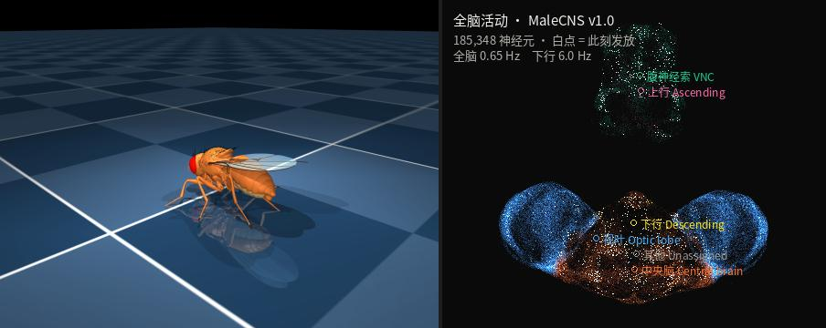
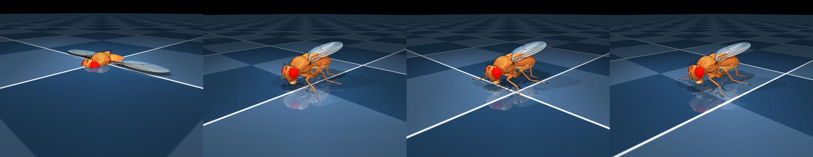
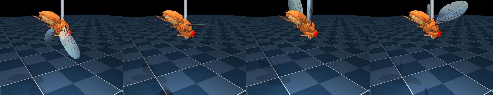
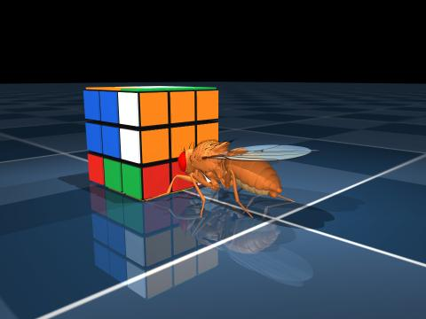
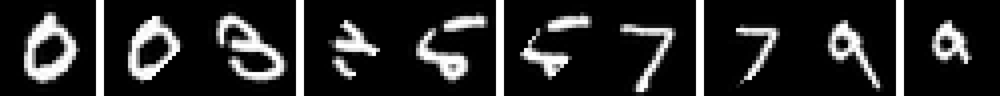
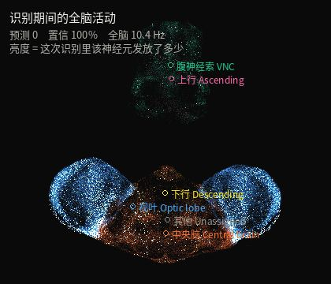

# 数字果蝇 Digital Fly

[English](README.md) · 中文

用真实的果蝇全脑连接组驱动一具真实的果蝇身体：**感觉 → 脉冲网络 → 下行指令 → 肌肉 → 物理 → 反馈**。



左边是 MuJoCo 里的果蝇身体，右边是同一时刻全脑 185,348 个神经元的活动，白点是正在发放的。

---

## 数据来自哪里

| 来源 | 内容 |
|---|---|
| **MaleCNS v1.0**（HHMI Janelia FlyEM · Cambridge · MRC LMB · Google Research，*Cell* 2026） | 176,422 个神经元、约 1.25 亿突触的完整雄性中枢神经系统接线图，含中央脑 + 视叶 + 腹神经索，颈部连接完整。CC-BY 4.0 |
| **flybody**（Google DeepMind × HHMI Janelia，*Nature* 643, 2025） | 解剖学精细的 MuJoCo 果蝇身体，六足 + 翅膀 + 喙 |
| **NeuroMechFly v2 / flygym**（NeLy-EPFL） | 真实测量的果蝇步态运动学 |

构建后的网络：**185,348 个节点、26,006,173 条突触边**。突触的**符号由突触前神经元的递质预测决定**：ACh 为 +1，GABA / 谷氨酸 / 组胺为 −1，单胺类默认 +1（可用 `--modulator-sign 0` 做对照）。

---

## 三分钟跑起来

```bash
bash setup.sh && conda activate digitalfly
python cli.py download          # 三个 feather 文件，约 1.2 GB
python cli.py build             # 构建带符号的稀疏矩阵
python cli.py calibrate         # 标定突触强度（必须做，见下）
python cli.py web --port 8080   # 打开 http://localhost:8080
```

---

## 大脑怎么跑

泄漏积分发放（LIF），参数取自 Shiu et al. (*Nature* 634, 2024)：

```
静息 −52 mV · 阈值 −45 mV · τ_m 20 ms · 不应期 2.2 ms · 步长 0.5 ms
```

**突触强度必须标定。** 文献里 0.275 mV 的单突触 EPSP 直接用在这套连接组上会让全网癫痫（48 Hz）。`calibrate` 用二分法找"网络不自持"的临界点，得到 **0.0341 mV**。所有实验都在这个工作点上跑。

**感觉输入用发放率编码**，不是持续电流。LIF 没有适应机制，恒定电流会把网络顶到饱和（不管强度多大都停在 11 Hz）。改成每步以 `p = rate × dt` 的概率注入一个脉冲，输入强度才真正可分级。

后端三选一自动降级：`torch-cuda` → `torch-cpu` → `scipy`。

---

## 贯穿全项目的一条限制

> **在标定后的工作点上，这套重建只能可靠传递大约一个突触。**

这不是调参问题，是反复测出来的结构性事实，它决定了下面每一个设计：

| 通得过（一个突触） | 通不过（两个及以上） |
|---|---|
| 视网膜 → 髓质（线性可解码 85.8%） | 髓质 → VPN → 蘑菇体 |
| 触角叶投射神经元 → Kenyon 细胞（22,586 条连接） | 视网膜 → 髓质 → LC（**LC4+LC12 共 624 个细胞，一个都不发放**） |
| 味觉 GRN → 伸喙运动神经元 MN9 | 双侧气味 → 下行神经元的左右不对称 |

所以后面凡是要"读出"的地方，读出层都被迫放在离输入一个突触的位置。

---

## 行为

```bash
python cli.py behave --mode walk   --seconds 4    # 行走
python cli.py behave --mode forage --seconds 6    # 觅食
python cli.py behave --mode flight --seconds 3    # 拴系飞行
```

**行走**：下行神经元（DN）的群体发放率读出成 speed / turn 两个指令，喂给由真实运动学驱动的步态发生器。DN 不直接控制关节 —— 试过，果蝇会当场瘫掉；连接组给出的是神经元身份，不是它到 MuJoCo 执行器的定量力学映射。实测 **1.31 体长/秒**。

**觅食**：气味浓度按左右触角分别注入，果蝇趋近糖源；够到之后伸喙，**伸喙这一段是连接组算出来的** —— 糖味 GRN 激活时 MN9 发放 16.7 Hz，苦味时 0.0 Hz。

**飞行**：自由飞行搜了 150 组参数全部翻滚，所以做成**拴系飞行**（画面里有可见的拴系杆），只看翅膀运动学和转向读数。躯干俯仰 47.5°。

 

---

## 拧魔方



果蝇走到魔方跟前、正对着停下，然后用**前腿（T1）**去拨要转的那一面，方块跟着这一拨转动。分工是明确的：

| 哪一部分 | 谁决定 |
|---|---|
| **什么时候拧** | 连接组 —— 下行神经元群体发放率积分到阈值才触发一次转动，网络越活跃拧得越快 |
| **拧哪一面** | IDA\* 求解器（角块朝向 3⁷ / 棱块朝向 2¹¹ / 角块置换 8! 三张剪枝表） |
| **前腿这一拨** | 运动学动画。腿的姿态和面的转角用同一个相位，不是物理摩擦驱动 |

DN 的六个子群也各投一票选面，和求解器的一致率会显示在界面上：**实测约 17%，和随机持平**。也就是说，连接组决定了节奏，但没有编码"拧哪一面"——这是个如实报告的阴性结果。

---

## 字符识别

这是项目里最费周折的一块，中间推翻过两次。最终方案：

### 判决发生在连接组内部

```
图像 ──► 892 个六角视柱 ──► L1（ON）/ L2（OFF），1,785 个真实板层神经元
                                    │  ★ 12,710 条可塑突触 —— 连接组里本来就有的
                                    ▼
                          Dm6 / Dm19 / Dm17 / Dm15 / Dm1
                          665 个宽场无长突细胞，分成 10 组
                                    ▼
                            哪一组发放最多，答案就是几
```

**分类器的参数就是 `W` 里的元素本身。** 没有第二套权重，没有反向传播。



*每对：左边原图，右边是按 892 个六角视柱采样后重建的 —— 映射是忠实的。*

### 为什么是这些神经元

判决层选 Dm 类宽场无长突细胞，两条实测理由：

| | Dm17 | Dm19 | Dm6 | Tm1（最初选的） |
|---|---|---|---|---|
| 每胞汇聚视柱数 | **204** | **130** | **44.5** | **0.6** |
| 发放率 | 90.9 Hz | 113.8 Hz | 48.5 Hz | 2.2 Hz |
| 跨字符调制 | 20% | 13% | 19% | 8% |

单柱细胞 Tm1 平均每胞只有 0.6 条来自 L1/L2 的突触 —— 绝大多数根本没有可塑输入；而且把它们分成 10 组之后，每组只看得到视野的 1/10，各组比的是图像的不同部分。**判决要对整张图做，判决神经元就必须汇聚整个视野。**

按生物学，果蝇真正的视觉判决神经元是 LC（小叶柱状细胞，Wu et al. *eLife* 2016）。这里用不了：**LC4 + LC12 共 624 个细胞，在标定工作点上一个都不发放** —— 隔了两个突触。

### 怎么训练

规则和蘑菇体的一样：**教学信号门控的双向突触可塑性**（Hige et al. *Neuron* 2015；Cohn et al. *Cell* 2015；Aso & Rubin *eLife* 2016）。

```
呈现 600 ms ──► 各组发放率 ──► argmax 给出答案
                                  │
            答错 ──► 正确组的活跃突触增强
                     错误获胜组的活跃突触压低
            答对 ──► 缓慢恢复
```

四条约束，缺一个就学不动，每一条都是实测逼出来的：

1. **必须双向。** 只做抑制的话权重锁在 [0, w0]，正确类永远超不过基线，系统只能单调收缩 —— 实测 4 类卡在 42.5%，突触总强度掉到 0.87 还在降。
2. **突触前活动要按各自基线归一。** 手写图 80% 的像素是黑的，OFF 通道对每个字符都全亮，不归一的话"当时活动的"这个门选不出任何东西，抑制退化成无差别的全局衰减。
3. **要有突触缩放**（Turrigiano 1998）。不加约束时增强会赢，总强度一路涨到 1.378，判决被整体漂移主导。按组把总强度拉回原值，保留相对权重。
4. **注视要够久。** 240 ms 时信噪比只有 1.45（噪声和信号一样大）；600 ms 涨到 4.05；1500 ms 不再改善。

### 老实说结果

| | 准确率 | 随机 |
|---|---|---|
| 髓质活动**线性可解码**上限 | **85.8%**（像素基线 86.9%，打乱标签 9.6%） | 10% |
| **脑内判决** 4 类（一轮） | 14.6% → **52.1%** | 25% |
| **脑内判决** 10 类（14 轮） | 14.2% → **36.7%**，训练集 45% | 10% |

10 类不是均匀的 36.7%，而是**有的数字学会了，有的完全没学会**（每类 12 张测试）：0 对 10/12、1 和 4 各 8/12；而 2、5、7 是 0/12 —— 0 成了吸引子，7 几乎全判成 9。这是判决层容量不够的典型表现：665 个神经元分 10 组，每组只有 66 个细胞、约 1,270 条可塑突触。

**信息确实在脑子里** —— 同一批髓质神经元的活动线性可读出 85.8%，是像素基线的 99%。脑内规则只到 36.7%，这 49 个百分点就是"用果蝇自己的突触、果蝇自己的学习规则"的代价，如实摆在这里。

再往上走，瓶颈是判决层容量而不是学习规则。真正该用的是 LC 神经元（624 个细胞、高度汇聚），但它们在标定工作点上一个都不发放 —— 还是那堵"只传得动一个突触"的墙，加训练轮数绕不过去。

三轮迭代的账：

| 版本 | 4 类 | 10 类 | 问题出在哪 |
|---|---|---|---|
| 单向 + Tm1 单柱细胞 | 42.5% | — | 权重锁在 [0, w0] 单调收缩；判决神经元平均只有 0.6 条可塑输入 |
| 双向 + Dm 宽场细胞 | **52.1%** | 13~23% 震荡 | 增强失控，突触总强度涨到 1.378 |
| 双向 + Dm + 突触缩放 | — | **36.7%** | 强度全程锁在 1.000，稳定上升到平台 |

Web 界面里可以鼠标手写、点识别，并看到识别期间全脑哪些神经元亮了。



---

## 蘑菇体的联想学习

唯一一处学习**完全发生在连接组内部**且效果扎实的地方：改的是 61,210 条真实 KC→MBON 突触。

```
气味 A + 多巴胺（相当于电击）×10 回合
  → 配对气味 A 在惩罚区室的输出 −39.0%
  → 未配对气味 B  +7.8%
  → 特异性 5.0 倍，并出现效价翻转
```

两处模型补充必须标出来：**稀疏编码是显式加的**（APL 只有 2 个神经元，压不住 64 万条 KC→KC 递归兴奋，实测任何输入都把全部 4,064 个 KC 点亮到 145 Hz）；**稀疏化按每个 KC 自己的基线**（不归一时两种气味的 KC 编码重叠 73%，比输入重叠 25% 还高；归一后降到 0%）。

视觉走不了这条路：视觉进 KC 只有 1,616 条连接，是嗅觉通路的 1/35，放大 25 倍后数字分离度仍是 1.02。

---

## Web 控制台

```bash
python cli.py web --host 0.0.0.0 --port 8080
```

- **3D 画面可鼠标自由拖动**：拖动旋转、滚轮缩放、双击复位
- 在线切换行走 / 觅食 / 拴系飞行 / 拧魔方
- 注入刺激、切除神经元群、接管速度与转向、移动糖源
- 全脑活动热图、脉冲栅格图、发放率时间序列
- 鼠标手写 + 识别 + 反馈

**脑和身体是两条线程。** 全脑一步要 3.5 ms，脑只能跑到真实时间的 30%；身体要是跟着脑步走，画面就是 3 FPS。拆开之后：

| | 改前 | 改后 |
|---|---|---|
| 帧率 | 3 FPS | **20 FPS** |
| 身体 | 0.29× 真实时间 | **0.99×** |
| 脑 | 0.14× | 0.30× |

代价写清楚：交互模式下脑的仿真时间比身体慢约 3 倍，物理步长从 0.1 ms 放大到 0.4 ms（实测仍稳定，步速 1.31 vs 1.07 体长/秒；0.8 ms 接触就失效）。要严格 1:1 请用 `behave` 命令离线出视频。

---

## 命令一览

```bash
python cli.py download                 # 下载连接组
python cli.py build                    # 构建网络
python cli.py calibrate                # 标定突触强度
python cli.py doctor                   # 自检 + 与 neuprint 公共 API 交叉校验
python cli.py sim --exp sugar_pe       # 糖 → 伸喙（阳性）
python cli.py sim --exp ablation       # 切除揭示前馈抑制
python cli.py sim --exp steering       # 气味侧别编码（阴性）
python cli.py sim --exp cube_decode    # 魔方下一步解码（阴性）
python cli.py sim --exp vision         # 视觉解码（阳性）
python cli.py sim --exp conditioning   # 嗅觉联想学习
python cli.py train-vision             # 训练手写识别读出层
python cli.py behave --mode walk|forage|flight
python cli.py web --port 8080
pytest tests/                          # 74 项测试
```

---

## 项目结构

```
digitalfly/
  connectome.py    feather → 带符号 CSR 稀疏图
  brain.py         LIF 引擎（torch-cuda / torch-cpu / scipy）
  calibrate.py     突触强度标定
  neurons.py       按 type / class / ROI / side 查询
  body.py          flybody MuJoCo 封装 + EGL 离屏渲染 + 自由视角
  bridge.py        DN → 指令；本体感觉 / 视觉 / 味觉 → 注入电流
  locomotion.py    真实运动学步态、翅拍
  vision.py        按六角视柱坐标把图像呈现到复眼
  visual_brain.py  脑内视觉判决 + 双向可塑性 + 突触缩放
  handwriting.py   MNIST 训练 + 线性可解码上限
  plasticity.py    蘑菇体：多巴胺门控的 KC→MBON 可塑性
  cube.py          魔方状态 + IDA* 求解器
  cube_scene.py    26 个 mocap 块的场景
  cube_hands.py    前腿拨动魔方
  brainview.py     全脑三维点云（真实胞体坐标）
  experiments/     sugar_pe · ablation · steering · cube_decode
                   vision_decode · conditioning
  web/             Flask + SSE + MJPEG 控制台
```

---

## 哪些是数据，哪些是工程近似

**是数据驱动的**：连接图本身、突触符号（来自递质预测）、神经元身份与分区、LIF 动力学、可塑突触的位置与数量、视柱的六角坐标。

**是工程近似，代码里都标了**：DN → MuJoCo 执行器的映射（连接组给身份，不给定量力学）、蘑菇体的稀疏编码（替 APL 做它在真实果蝇里做的事）、判决组与字符的对应关系（任意指定，和真实果蝇里 MBON 的效价由 DAN 决定是一回事）、前腿拨魔方的运动学动画、觅食时的双侧气味比较转向。

## 引用

- Janelia FlyEM 等，MaleCNS v1.0 连接组，*Cell* (2026)
- Vaxenburg 等，flybody，*Nature* 643 (2025)
- Shiu 等，全脑连接组 LIF 仿真，*Nature* 634 (2024)
- Hige 等，*Neuron* (2015)；Cohn 等，*Cell* (2015)；Aso & Rubin，*eLife* (2016)
- Wu 等，LC 神经元与行为，*eLife* (2016)
- Turrigiano 等，突触缩放，*Nature* (1998)
